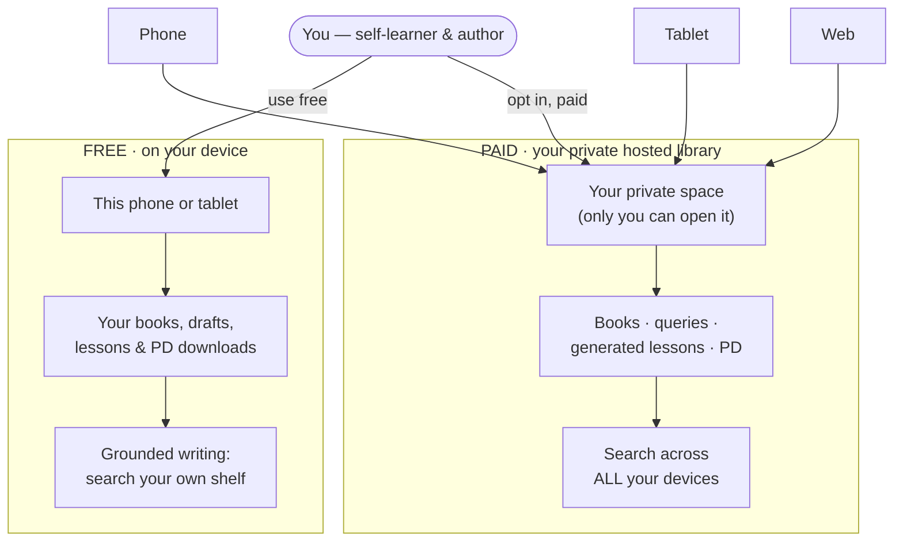
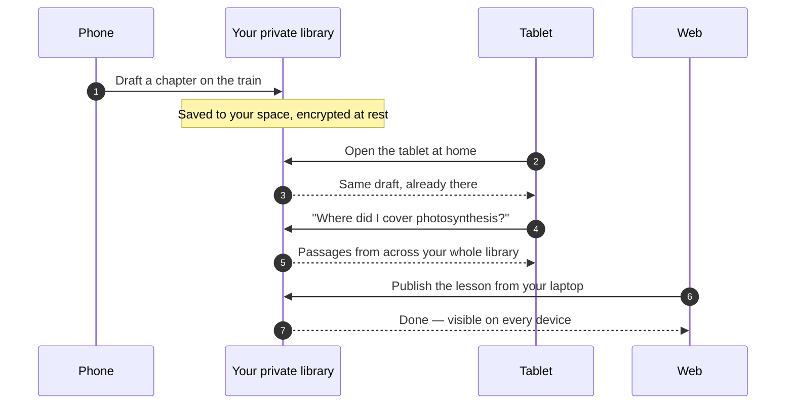

# ADR-033 — User-facing view: your library, two ways

> Plain-language companion to `docs/adr/ADR-033-per-user-private-hosted-library.md`.
> Interactive version (renders the diagrams + light/dark): artifact
> `52f0fb35`/`a33e9e59` — see the chat that produced this. This file is the
> read-and-digest copy; the diagrams below are Mermaid and render on GitHub.

**One line:** Write and learn on your own device for free — or unlock a private,
hosted library that follows your account to every device you own.

- 🟢 **Free** — lives on your device
- 🟡 **Paid** — private, hosted, synced across your devices

Both tiers are private. They differ in *where your books sit* — on the phone in your
hand, or in a private space that any of your devices can open.

---

## Pick where your library lives

### 🟢 Free · on device
- Your **books, drafts, and lessons** stay on this device
- **Grounded writing:** search your own shelf as you author
- Public-domain downloads live here too
- Works fully **offline**
- **Zero-knowledge** — we never see any of it
- No account needed

### 🟡 Paid · private hosted
- Your books, **queries, and generated lessons** live in your private space
- Open the **same library on phone, tablet, and web**
- **Search across everything** you've written, from any device
- Public-domain downloads come along
- Private to you — **never shared, never used to profile you**
- Opt-in subscription, includes a starting storage & usage allowance

---

## Where your library lives

On the free tier your shelf is bound to one device. Turn on the hosted tier and the
same shelf answers from all of them — because it lives in your private space, not on
any single phone.

*Free: one device holds everything. Paid: your devices are windows onto one private
library.*

---

## One day, three devices

What the hosted tier actually feels like: you start on one device and finish on
another, and your library — and its search — is simply there.

*No copying files around, no "which device has the latest?" — the library is the
source of truth.*

---

## What "private" means — honestly

To search your writing on the server, the hosted tier has to read it while indexing.
So it isn't the zero-knowledge guarantee the free tier gives — and we say so plainly
rather than imply otherwise.

**What we promise (paid tier)**
- Your library is **yours alone** — no other user ever sees it
- Stored **encrypted at rest**
- Used **only** to power your own search — never to profile or advertise
- Delete a book or your account and the copy **and** its search index are purged
- Export your library whenever you want

**What we're honest about**
- The server **reads your content** to build the search index — so the hosted tier is
  **not zero-knowledge**
- Prefer no server ever touching your work? **Stay on the free device tier** — it
  stays zero-knowledge
- The hosted tier is **opt-in and paid** — never switched on for you

---

*Illustrates the decision in `ADR-033 — per-user private hosted library`: an opt-in,
paid tier holding your own authored content, queries, generated lessons, and
public-domain downloads, synced across your devices. The free, device-local,
zero-knowledge tier (ADR-028/029) is unchanged. Hosted features arrive with the
managed-billing launch.*
