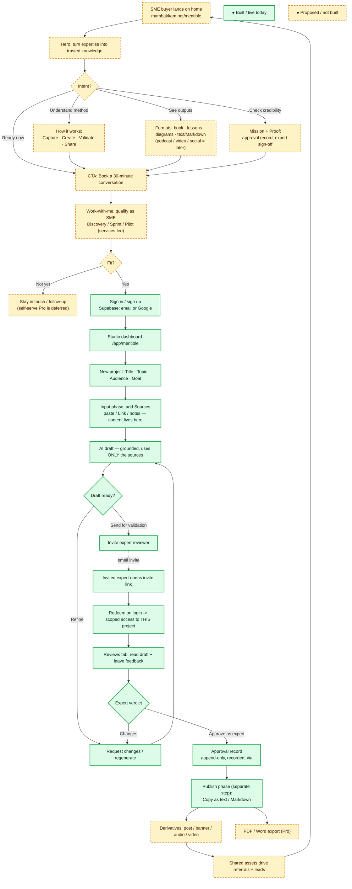
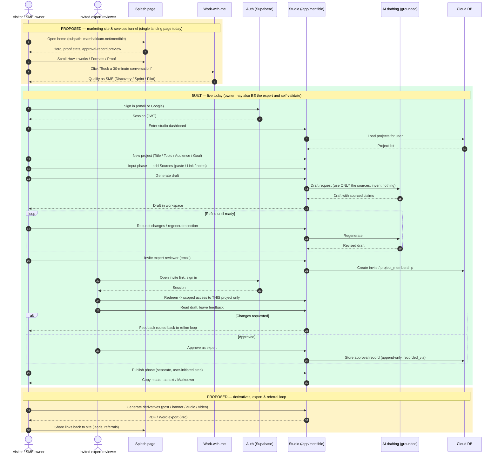

# Splash → Studio funnel (built vs. proposed)

The visual companion to [ADR-037](adr/ADR-037-reposition-to-expert-validation-studio.md)
(the SME expert-validation reposition): the whole visitor journey from the public
splash to the Studio's Capture → Create → Validate → Share loop, with every node
marked **built/live** or **proposed/not-yet-built**.

**Key:** 🟩 green = built / live today · 🟨 amber (dashed) = proposed / not yet built.

> **Status note (updated 2026-08-14).** Since this diagram was first drawn, part of the
> amber funnel has **shipped**: the **`/work-with-me` page** (in-app route, scheduler
> link-out to `calendly.com/wegofwd2020`, mailto fallback — #453/#454) and the **"Work with
> me" CTA** on the landing page (`mambakkam.net/mentible` — mambakkam-net #118) are now live.
> So the "Book a 30-minute conversation" (`G`) and "Work-with-me: qualify" (`J`) nodes below —
> and the sequence's first proposed zone — are effectively **built** now, via a Calendly
> link-out whose booking form carries the qualify questions. The **fuller marketing site**
> (hero, intent grid, About/Books/Content, Mission+Proof) is still proposed. The nodes are
> left amber below to preserve the original as-analyzed snapshot; this note is the delta.

---

## 1. Flow — visitor decision tree

> The SME owner may also **be** the expert and self-validate; the invited-reviewer branch is the two-actor case.

---

## 2. Sequence — actor messages

---

## Build reality behind the colors

- **Built (green):** Supabase auth · Studio dashboard · New project (Title/Topic/Audience/Goal) ·
  Input/Sources · grounded AI draft · refine loop · invite → redeem → Reviews (scoped
  `project_membership`) · expert approve → append-only approval record (`recorded_via`) ·
  Publish (Copy text/Markdown). **Plus (shipped 2026-08-14, see status note):** the
  `/work-with-me` page + landing "Work with me" CTA (services funnel via a Calendly link-out).
- **Proposed (amber):** the fuller marketing site (hero, intent grid, About/Books/Content,
  Mission+Proof), the Formats grid extras (podcast/video/social — note video = animated SVG
  only), derivatives (short-form studio, PR #338), PDF/Word export, the referral loop, and
  self-serve Pro (deferred).

Source diagrams: `Mentible_Splash_Page_Flow_Corrected.mmd` /
`Mentible_Splash_Page_Sequence_Corrected.mmd`.
