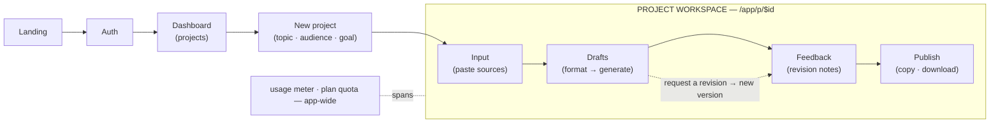

# Studio Flow Teardown — Sridhar's Lovable prototype

> **Source:** `mentible_loverable_ux` (a Lovable prototype — TanStack Start + Supabase).
> **Rendered deck (artifact):** https://claude.ai/code/artifact/d6d17226-a8fe-4b12-9739-385eb9bbfc66
> **Status:** Reference / adaptation review — **not a build spec.** Captured 2026-08-12.
> **What drove:** the guided-first-draft + unified-panel + per-topic-parity arc (#411–#418). See
> `project_lovable_ux_teardown` in memory and `docs/studio-vs-projects.md`.

A screen-by-screen map of the UX flow Sridhar compiled — a brochure site turned into a working product.
Each screen is inventoried with its purpose and key elements, and flagged for how it sits next to what
Mentible ships today, to decide **what to adapt vs defer**.

At-a-glance tags: **14 routes · 4-tab workspace · Capture · Create · Validate · Share · source-grounded ·
Free / Pro tiers.**

Legend used throughout: **✅ Shipped** (we already have it) · **✨ New idea** (not in ours) · **≠ Differs**
(we do it differently).

---

## 01 · The flow at a glance

Public front door → sign in → one linear studio loop per project. One project runs the whole loop; the
**Drafts ↔ Feedback** revise cycle repeats until a draft is approved and moved to Publish. A **usage meter
(plan quota)** spans the whole app.

*(Reproduces the deck's §01 flow SVG: entry row Landing→Auth→Dashboard→New project drops into the dashed
Workspace band Input→Drafts→Feedback→Publish, with the gold Drafts↔Feedback revise loop and the app-wide
usage-meter pill.)*

---

## 02 · Public front door

The marketing site, retitled from brochure toward product. CTA everywhere → sign in.

| Route | Screen | Flag | Note |
|---|---|---|---|
| `/` | **Home** — landing; positions the studio, primary CTA "Start your studio" → Auth | ≠ Differs | We have a landing on **mambakkam.net**; this one is product-first, not download-first. |
| `/about` | **How Mentible works** — explains the loop **Capture · Create · Validate · Share** | ✅ Shipped concept | Matches our four-phase framing (ADR-037); useful copy reference. |
| `/content` | **Short-form output** — podcasts, reels, posts & threads ("one input, many formats") | ✨ New emphasis | We generate formats too, but don't market a short-form gallery. |
| `/books` | **Long-form output** — books & manuals from expertise | ✅ Shipped | Our Studio/Books product covers this; framing differs. |
| `/pricing` | **Pricing** — Free vs Pro, pilot offers; feeds the Pro upsell on Publish | ≠ Differs | Our billing (ADR-005) is built but **dormant**; this wires Pro into the flow. |
| `/work-with-me` | **Design partner** — recruits SME design partners (services-led, ADR-037) | ✅ On-strategy | Plus peripheral portfolio/demo routes (`/kaundinya`, atri-sangam demos). |

---

## 03 · Auth

One screen, two modes — the gate into the studio.

- **`/auth` — Sign in / Sign up** (≠ Differs): toggles "Welcome back" ↔ "Start your studio"; email +
  password plus **Google SSO**. Supabase / Lovable Cloud auth; a `profiles` row is auto-created on signup
  (plan defaults to `free`); protected routes redirect to `/auth` when signed out. *We already use
  Supabase + Google (ADR-014) — same primitive, different screen.*
- **App shell — Studio chrome** (✨ New idea): sticky top bar on every app screen — **Mentible · Studio**
  wordmark, breadcrumbs, a live **usage meter** (plan + generations used / limit), "New project", sign
  out. *The in-shell usage meter is the standout — surfaces quota where the work happens.*

---

## 04 · Studio app — the spine

Dashboard → create → workspace. Three screens carry the whole product.

- **`/app` — Dashboard** (✅ Shipped): grid of project cards (title, topic, status, audience/goal). Empty
  state "Your first project awaits" → Create. *Our Projects tab is the analog; card content is richer here.*
- **`/app/new` — New project** (≠ Differs): four fields — **title, topic, audience, goal** — then straight
  into the workspace. *The audience/goal framing up front is worth a look.*
- **`/app/settings` — Settings** (≠ Stub): plan, usage, billing portal — **planned in the brief, not built**
  in this prototype (route absent from the source; flagged so nobody expects a real screen).

---

## 05 · Inside the workspace

One page, four tabs with live counts — the heart of the flow and the richest source of ideas.
Tabs: **Input (n) · Drafts (n) · Feedback · Publish (n)**.

- **Tab · Input — Add source material** (≠ Differs): optional label + a paste box (transcript / notes),
  live **/ 50,000-char counter**; a "sources on file" rail lists what's added. Copy is explicit: "the studio
  only uses what you provide — nothing invented." *Kinds are **transcript / note only — no Link**. We just
  shipped a Link→URL field (#409); their input is simpler but less capable.*
- **Tab · Drafts — Format palette → draft** (✨ New idea): left rail of six one-click formats —
  **LinkedIn · X thread · Reel · Podcast cold-open · Essay · Chapter outline** — each with a length hint;
  plus a drafts list. Right: the artifact panel. *The one-click multi-format palette with hints is crisper
  than our whole-book / per-topic split.*
- **Tab · Drafts → Artifact panel** (≠ Differs): reads the draft body, then **Approve / Unapprove** toggle,
  **Copy**, a "**Request a revision**" free-text box that drafts a new version, and inline **version
  history** with each version's feedback note. *Revision = free-text note → new version carrying that note
  as provenance. Lighter than our append-only approval records + `recorded_via`.*
- **Tab · Feedback — Revision notes log** (✨ New idea): aggregates every "request a revision" across all
  drafts into one read-only timeline (format · version · date · note). *A single project-wide feedback
  ledger — we don't surface one place like this.*
- **Tab · Publish — Ship approved assets** (≠ Differs): only approved drafts appear. Per asset **Copy** and
  **Download Markdown**; **PDF / DOCX gated behind Pro** (links to pricing). *We publish to the Library +
  EPUB/PDF via the compiler; theirs is copy/download-MD with a Pro wall.*
- **Cross-cutting — Usage & grounding** (✨ New idea): every generate checks the plan quota server-side and
  logs a usage event; the shell meter reflects it live. Generation is strictly source-grounded.

---

## 06 · Data & rules model

What sits behind the screens (Supabase, server functions).

| Table | Shape |
|---|---|
| `projects` | `title · topic · audience · goal · status` — one per SME theme. |
| `project_inputs` | `kind (transcript \| note) · title · content` — the grounding sources. |
| `artifacts` | `format · title · status (draft \| approved) · current_version`. |
| `artifact_versions` | `version · body_md · feedback_note · created_at` — append-per-revision. |
| `usage_events` | `kind · tokens` per generation; summarized into the meter. |
| `profiles.plan` | `free \| pro` — enforced server-side. Free ≈ 2 projects / 20 generations·mo; Pro ≈ unlimited / 500. |

---

## 07 · Signals to weigh (adapt / skip)

Where their flow diverges from what we ship — factual, for the adapt/skip call.

| Signal | Read |
|---|---|
| **Unified tabbed workspace** | One page, four tabs with live counts vs our phase-gated wizard. Reads faster, never hides a phase — but drops the guided hand-holding. |
| **In-shell usage meter** | Plan + generations-used bar in the top bar on every app screen. We have billing built but dormant and no visible meter. |
| **One-click format palette** | Six formats with length hints, one tap to draft. Crisper than our whole-book / per-topic mode toggle. |
| **"Request a revision" → version** | Free-text note produces a new version carrying the note. Lighter than our append-only approval records with `recorded_via`. |
| **Project-wide feedback log** | All revision notes in one timeline. We record feedback per version but don't roll it up. |
| **No Structure / TOC phase** | They draft whole artifacts straight from Input — no outline step, no per-topic generation. We shipped a TOC arc + per-topic mode this month — a capability **we have and they don't**. |
| **Input kinds** | Transcript / note only — no Link source (we added Link→URL, #409). Their input is simpler; ours captures more. |
| **Publish surface** | Copy / download-Markdown + a Pro wall for PDF/DOCX. We publish to the Library and compile real EPUB/PDF. |

---

## What we adapted from this (decided 2026-08-11)

- **Adapt the first-working-AI-draft path (steps 1–3):** New project → Add source (Input) → Generate first
  draft, with wayfinding. Shipped across **#411** (guided next-step banner), **#412** (unified artifact
  panel), **#413** (visual pass — Fraunces + gold), **#414–#418** (per-topic full-parity: Revise ·
  provenance+history · feedback thread · manual edit).
- **Deferred:** the **Stripe / usage-meter** pass (in-shell meter, Free/Pro gating, Publish Pro-wall).
- **Do not regress:** we already have MORE on the create side than the prototype — the Structure/TOC arc,
  per-topic mode, Link sources (#409), and real EPUB/PDF publish. Adapt the flow/wayfinding, not the
  capability.
