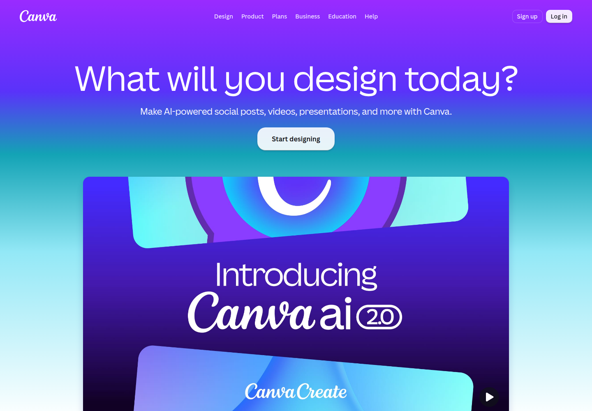
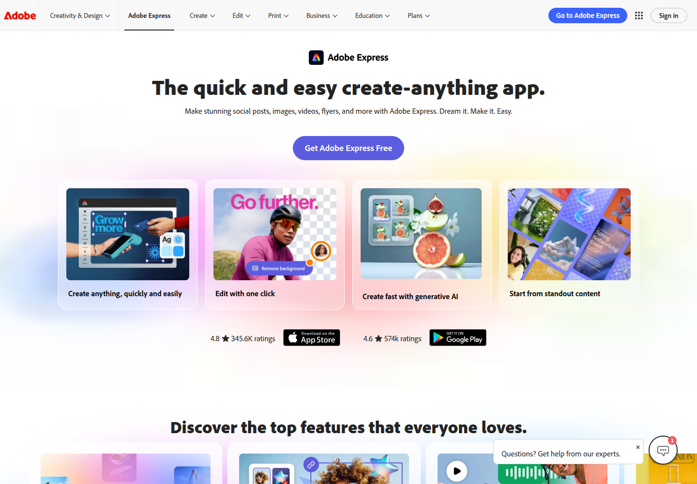
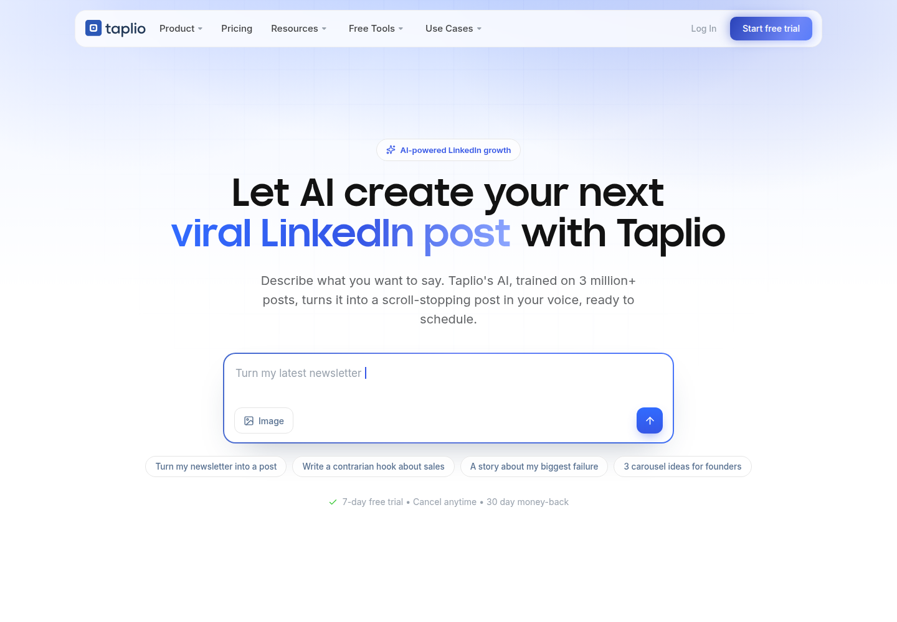
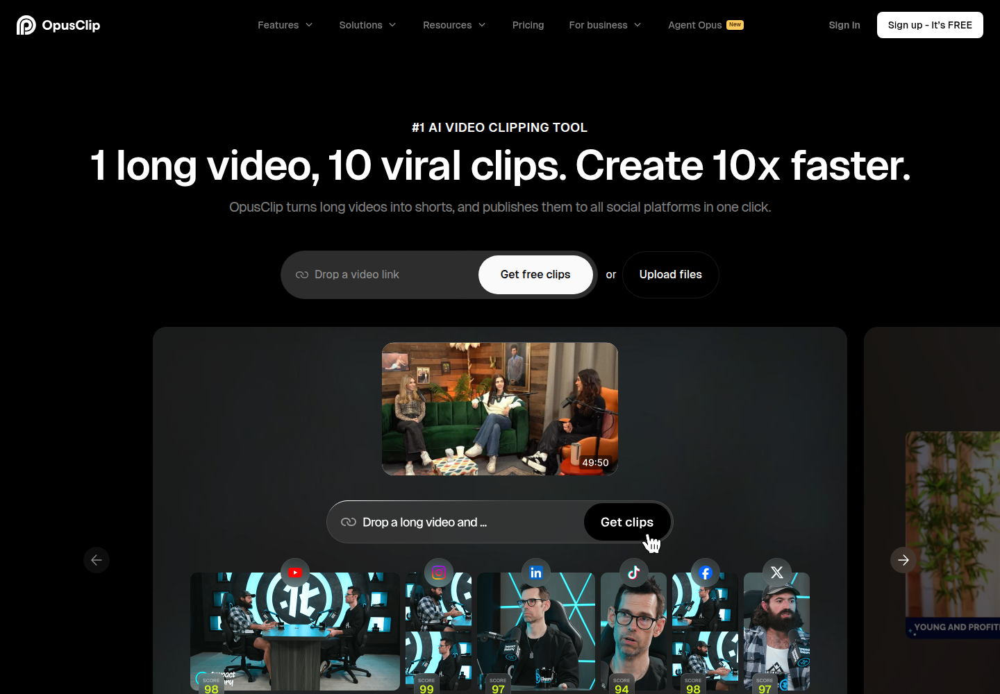
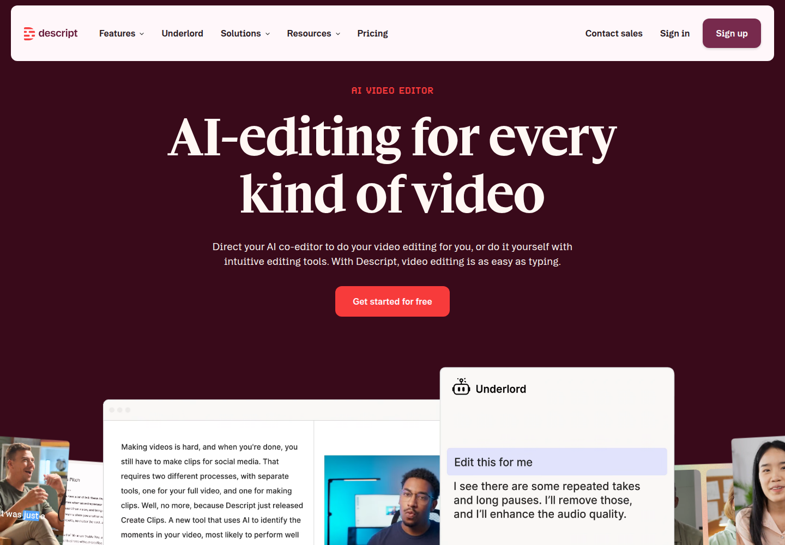
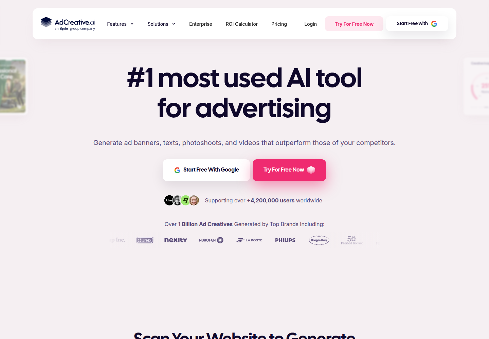
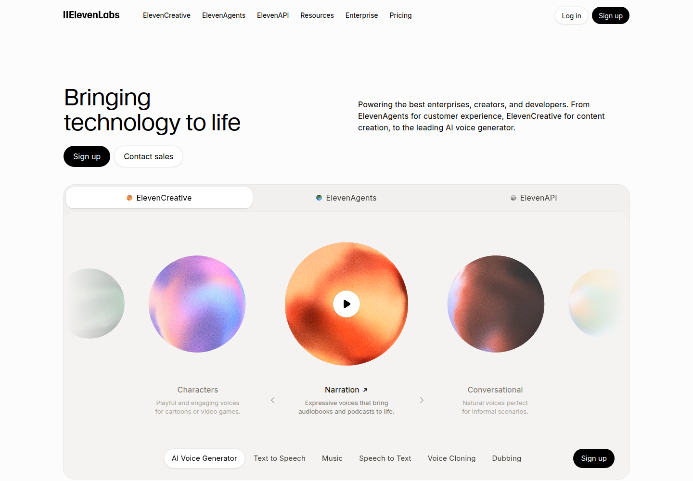
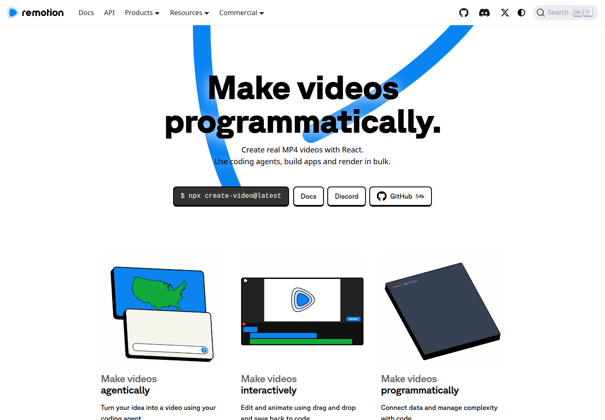
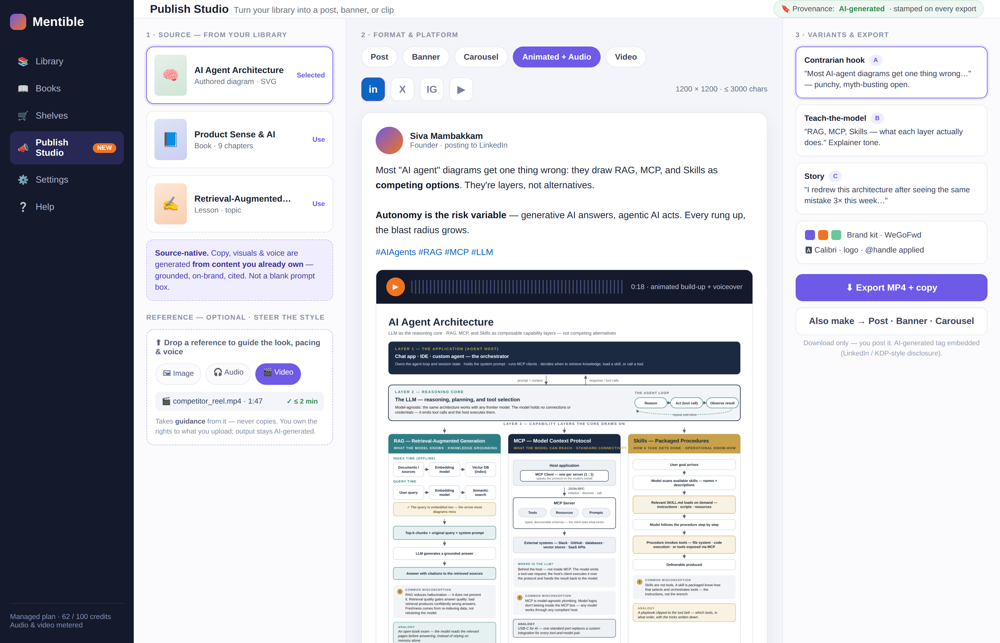

# Short-Form Publishing — UI Landscape + Proposed Mentible Studio

**Status:** Draft / exploratory · **Date:** 2026-07-27
**Companion to:** [`2026-07-27-short-form-publishing-studio.md`](./2026-07-27-short-form-publishing-studio.md) (requirements + competitor list)

**What this is:** live UI captures of the products already serving the "idea/asset → post · banner · animation · audio" space, read for their interaction patterns, followed by a **proposed Mentible "Publish Studio" UI** designed to stand out via the one thing none of them have — *source-native* generation from content the user already owns.

> **Method / attribution.** Screenshots captured live on 2026-07-27 from each vendor's public marketing site (headless Chromium, 1440px). They are third-party product UIs reproduced here for **competitive analysis / commentary** only, each credited to its owner. No affiliation or endorsement. The Mentible mockup is our own design, rendered from `mentible-studio-mockup.html` in the assets folder.

---

## 1. The landscape

Ordered by which slice of our scope they own. Each is the *current live UI*, not a mockup.

### Canva — the all-in-one gorilla

**UI read:** one giant "Start designing" CTA + "Canva AI 2.0" front-and-centre. Everything is template-first: pick a size, drop into an editor. **Owns:** post + banner + carousel + basic video/voice, Brand Kit. **Gap for us:** blank-canvas / template start — you bring the idea and the content every time. Not source-driven, not knowledge-grounded.

### Adobe Express — Canva's mirror

**UI read:** four capability cards — *create · edit one-click · generative AI · start from standout content*. Same template-first model, Adobe asset/font muscle. **Same gap:** general-purpose design surface, no notion of "generate from my document."

### Taplio — closest to our text flow

**UI read:** the whole hero **is the product** — a prompt box ("Turn my latest newsletter…") with quick-action chips (*Turn my newsletter into a post · 3 carousel ideas*). LinkedIn-only, "trained on 3M+ posts, in your voice." **This is the interaction to beat.** **Gap:** text/carousel only; no animation, no audio; source = your own past posts/newsletter, not a structured knowledge library.

### OpusClip — repurpose, done well

**UI read:** "Drop a video link → Get clips," then a grid of auto-cut shorts with per-platform icons (YT/IG/LinkedIn/TikTok/X) and virality **score badges**. **Owns:** long-video → many-shorts repurpose + one-click multi-platform. **Gap:** input must be a *video*; nothing for text/knowledge sources. The score-badge + platform-fan-out pattern is worth borrowing.

### Descript — repurpose from words

**UI read:** doc-style editor + an **"Underlord" AI side-panel** ("Edit this for me → I'll remove pauses and enhance audio"). Edit video by editing text. **Owns:** transcript/audio → social clips — conceptually the nearest to "lesson → post." **Gap:** oriented around recorded media, not authored/structured content; heavy editor, not a quick generate-and-go.

### AdCreative.ai — branded banners at scale

**UI read:** "#1 AI tool for advertising — generate ad banners, texts, photoshoots, videos," scan-your-website-to-generate. **Owns:** brand-consistent banner/ad creative across sizes with performance framing. **Gap:** ad-conversion focused; input is a URL/brand, not owned educational content.

### ElevenLabs — the audio layer (a *provider*, not just a rival)

**UI read:** voice-catalog tabs (*Characters · Narration · Conversational*) with play-to-preview orbs + TTS/Music/Dubbing switcher. **Relevance:** this is the **candidate engine behind our FR-4 audio layer**, not something we'd rebuild. The UI pattern (pick voice → preview → apply) transfers straight into our audio step.

### Remotion — the programmatic-video engine

**UI read:** "Make videos programmatically — real MP4 with React," three modes (*agentically · interactively · programmatically*) with a timeline editor. **Relevance:** this **is** our §-5 animation→frame-capture→encode lift. Build-vs-adopt reference for P3 (animated → GIF/MP4). Not a consumer competitor — an architectural option.

---

## 2. Patterns worth stealing vs. the gap nobody fills

**Recurring UI patterns (adopt these):**
- **The hero-is-a-prompt-box** (Taplio) — zero chrome between intent and first draft.
- **Quick-action chips** seeded with concrete jobs ("3 carousel ideas") — removes blank-page paralysis.
- **Platform fan-out with per-target previews + score badges** (OpusClip) — one source, many sized outputs, visible at once.
- **An AI side-panel that narrates what it's doing** (Descript "Underlord").
- **Preview-at-true-aspect-ratio before export** (all of them).
- **Voice-preview-then-apply** (ElevenLabs) for the audio step.

**The gap every one of them shares:** they all **start from a blank prompt, a URL, or a raw recording.** None generates *from a structured body of knowledge the user authored and owns.* Canva/Adobe = templates; Taplio = your past posts; OpusClip/Descript = a video you shot; AdCreative = your website. **Nobody turns "chapter 4 of my book" or "the diagram I authored last week" into an on-brand, cited post + animation + voiceover.**

---

## 3. Proposed Mentible "Publish Studio"

A three-step, single-screen flow — **Source → Format & platform → Variants & export** — that reuses the patterns above but inverts the starting point.

**1 · Source — from your library (the differentiator).** The first column is *not* a prompt box — it's your own **books, lessons, and authored diagrams**. Copy, visuals, and voice are generated *from content you already own*: grounded, on-brand, citable. This is the moat competitors structurally can't copy — they have no library. (Ties to the multi-modal Personal Library north-star + grounded-authoring ADR-029/033.)

**1b · Reference — optional, steer the style.** Below the source, an optional drop zone accepts an **image, audio clip, or short-form video (≤ 2 min)** as *guidance* — "make it look/sound/pace like this." The model takes structural/stylistic cues (layout, voice, beat) and produces an **original** artifact; it does not reproduce the reference. Ingest is multimodal (vision read for images, transcription + keyframe sampling for audio/video) and a **transient passthrough** (ADR-036 custody), not stored content. Because a reference may be someone else's work — the diagram used in this very mockup was itself Claude-generated *from a third party's output* — the UX frames it as "take guidance from, never copy," reminds the user they're responsible for rights to what they upload, and keeps the AI-generated provenance tag on the output (requirements §FR-1b / FR-7).

**2 · Format & platform.** Format tabs (*Post · Banner · Carousel · Animated+Audio · Video*) × platform selector that pins dimensions and char limits live (borrowed from OpusClip/Taplio). The preview renders at true aspect ratio, including the **animated+voiced** case — motion authored as SVG (existing decision), voiced by an ElevenLabs-class provider, muxed to MP4 on our own engine.

**3 · Variants & export.** A/B/C copy variants (Taplio-style, in your voice), a **Brand Kit** row (palette/font/logo/handle auto-applied), then **Export + one-click "Also make → Post · Banner · Carousel"** repurpose fan-out. Every export carries an embedded **AI-generated provenance tag** (same discipline as the KDP AI-disclosure work, #336-A) — download-only, the user posts it.

### Why this stands out
| Everyone else | Mentible Publish Studio |
|---|---|
| Start from blank prompt / template / URL / raw video | **Start from your owned, structured library** |
| Generic on-brand-if-you-set-it-up | Grounded + cited from the source content |
| One format per tool (text *or* video *or* audio) | One source → **post + banner + animation + audio**, one screen |
| Provenance optional/absent | **AI-generated tag embedded by default** |

**Build leverage:** the render engine already exists — the Chromium SVG→PNG rasterizer that produced today's diagram post is the banner/animation renderer. Text = the scoped-LLM IP. The genuinely new spend is audio (adopt a TTS provider) and video encode (adopt/eval Remotion) — see the companion requirements doc §5.

---

## Assets
- Competitor captures: `assets/short-form-studio-landscape/{canva,adobe-express,taplio,opusclip,descript,adcreative,elevenlabs,remotion}.png`
- Proposed UI: `assets/short-form-studio-landscape/mentible-studio-mockup.{html,png}`
