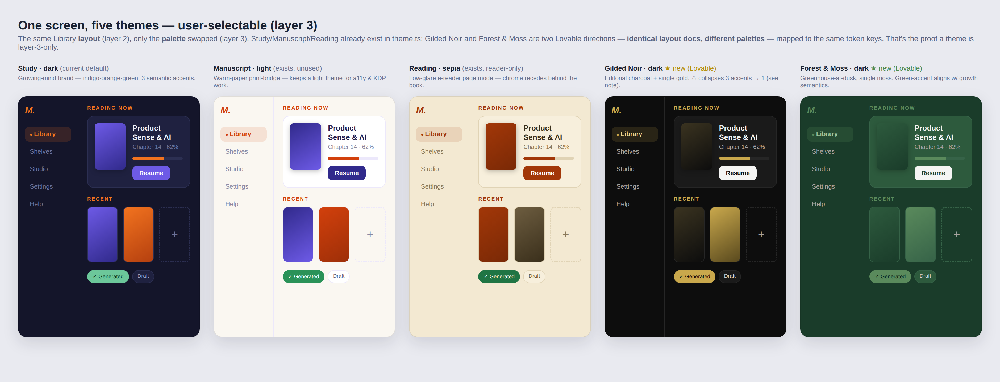

# Theming & Multi-Theme Support — Design Proposal

**Status:** Draft / exploratory · **Date:** 2026-07-27
**Stacks on:** PR #338 (Short-Form Publishing Studio) — this branch is cut from `docs/short-form-publishing-studio`, so its diff includes #338's docs until #338 merges. **Leave #338 alone; this builds on top.**
**Trigger:** a Lovable design direction ("Gilded Noir Minimalist", `mentible-design-direction.md`) proposing a charcoal+gold reader theme — which raised the broader question: **how do we support multiple themes and let the user pick one?**

---

## TL;DR
- The token groundwork **already exists** in `mobile/src/constants/theme.ts` — three palettes (`study`, `manuscript`, `reading`) + `Palette`/`ThemeName` types, explicitly "for a future theme switcher." **Nothing consumes them yet.**
- The missing pieces are **runtime**: a `ThemeProvider`, device-local persistence, a Settings switcher, and a **consumer refactor** (883 static `colors.` references across 78 files).
- The Lovable "Gilded Noir" direction is **beautiful but a brand pivot** and best adopted as **one selectable theme (reader-leaning)**, not a global reset — which is exactly what a theme switcher makes safe.
- Book/EPUB **output** styling is a **separate system** (`compiler/`, ADR-007) and must not move with the app theme.



---

## 0. The three layers (framing)

What can change, and *who* changes it, separates into three layers. Keeping them distinct is the core discipline of this proposal:

| Layer | What it is | Who changes it | When |
|---|---|---|---|
| **1 · App framework** | RN + Expo, expo-router, the runtime/binary | **Not the user** | Product release (app update) |
| **2 · UI layout** | IA + structure: nav set, sidebar, hero placement, grid, component arrangement | **Not the user** (auto-reflows by viewport) | Product release (ships in code) |
| **3 · Theme** | Colors + fonts, from **pre-packaged, curated** configs | **The user picks** | Anytime, in Settings |

**The insight this framing exposes:** the Lovable "Gilded Noir" direction **mixed layers 2 and 3** — it re-specified layout (256px sidebar, hero card, 2:3 grid) *and* colors/fonts together. That's *why* it read as a brand pivot rather than a theme. A **pure theme is layer 3 only**: recolor + refont the **same** layout. Separating the layers is exactly what makes Gilded Noir safely adoptable — as a palette, not a redesign.

**Notes:**
- Layer 3 can be **two independent axes** — a *color scheme* and a *font set* — rather than one bundled theme. Bundled configs are the simpler MVP (what "pre-packaged configurations" means here); the two-axis split is a later option.
- **Fonts straddle 2↔3:** font metrics affect line-wrapping (a layout concern), but as a bounded user choice they live fine in the theme layer.
- This whole proposal is about **layer 3 only** — a palette/font-swap mechanism + curated configs. Layers 1 and 2 are out of scope (they move with releases, not user choice).

---

## 1. Current state (grounded)

`theme.ts` today:
- Exports `colors` = **Study** (dark indigo/orange/green — the current default).
- Exports `manuscriptColors` (**Manuscript**, light warm-paper) and `readingColors` (**Reading**, sepia reader mode).
- Exports `themes = { study, manuscript, reading }`, `type Palette = Record<keyof typeof colors,string>`, `type ThemeName`.
- File comment: *"for a future theme switcher; nothing consumes them yet."*

Reality check (grep):
| Fact | Value |
|---|---|
| Files importing from `constants/theme` | **78** |
| Static `colors.X` references | **883** |
| `ThemeProvider` / `useTheme` / `ThemeContext` | **none** |
| Anything reading `themes` / `ThemeName` outside `theme.ts` | **none** |

So: **the palettes are defined but dead.** Every component imports the static `colors` object directly. Swapping themes at runtime requires routing those 883 sites through a provider.

---

## 2. The Lovable direction(s) — analysis (recorded)

*Full analysis of the Lovable directions, preserved as requested. §2 covers "Gilded Noir"; §2b the "Forest & Moss" variant.*

**What it is:** "Gilded Noir Minimalist" — charcoal `#0d0d0d` + single gold accent `#c9a84c`, quiet-luxury members-club reading library. Space Grotesk / DM Sans. Persistent 256px sidebar, sticky header, Continue-Reading hero, 2:3 cover grid. Web/Tailwind idiom (hover, `duration-1000`, `white/5`). It specs **one screen** — the Library reader home.

**Strengths (keep these):**
- **Editorial discipline** — single accent, hairline rules, section labels (11px uppercase, 0.2em tracking), content-first.
- **Clear IA** — Continue-Reading hero + Recent grid + empty-state is the right library-home hierarchy.
- **Reusable structural bones** — sidebar + sticky header + dismissible sign-in card map to existing surfaces.

**Risks / mismatches (ranked):**
1. **Brand collision — a pivot, not a re-skin.** Current brand is **"growing-mind"** (indigo `#6d5ae6` · orange `#f2731f` · green `#6cc79a`), bright/optimistic-learning, gradient `M` mark. Gilded Noir replaces it with gold-luxury + gold `M.` — a different *personality*: members-club **reading** vs. approachable **learning/authoring**.
2. **Mis-targets the product.** It's framed as a lean-back **reader library**. Mentible's identity is **authoring + Studio + learning**. Noir-luxury undercuts the create/learn positioning, and the spec covers only the Library home (nothing for authoring, reader interior, or the Studio it lists).
3. **Single-accent collapse (see mockup, col 4).** Mentible's palette carries **three semantic accents** — primary=indigo, action=orange, generation/progress=green. Noir's one gold **collapses all three into gold**: in the comparison image the "✓ Generated" chip, the progress bar, and the CTA are indistinguishable gold, where the other three themes keep them semantically colored. Real information loss, not just taste.
4. **Dark-only + a11y.** No light mode — the app is currently theme-*capable* light+dark, and the KDP/print + accessibility work leans on light. `stone-500 #78716c` meta on `#0d0d0d` ≈ ~4:1 (borderline for small text); small gold text is also marginal. A single dark theme is a regression unless deliberately reader-scoped.
5. **Nav drift.** Lovable lists **Library · Shelves · Studio / Settings · Help · About** — **drops "Books"**, adds "Studio". Current is Books-only (ADR-009): Library · Books · Settings · Help · About (+ Shelves). Reconcile before adopting (is Studio replacing Books, or additive as in #338?).
6. **Platform idiom.** Lovable emits React/Tailwind **web**; the app is **RN + Expo** (StyleSheet, not Tailwind; no hover on touch; `duration-1000` progress → Reanimated on native). Tokens must become `theme.ts` constants; Space Grotesk/DM Sans via `@expo-google-fonts`.

**Recommendation:** don't hard-pivot the whole app. **Adopt Gilded Noir as one selectable theme** (its noir mood suits the **reader** surface), while **authoring + Studio keep the bright growing-mind brand** (creation = energetic). A theme switcher makes this a user choice instead of a bet — and preserves the light themes for a11y/KDP.

### 2b. Second direction — "Forest & Moss" (empirical proof of the layering)

A second Lovable direction (`mentible-design-direction_forest_and_moss.md`) landed: **greenhouse-at-dusk** — forest-green surfaces (`#1a3c2a` / `#2d5a3d`) + a single **moss** accent (`#5a8a5c`), same Space Grotesk / DM Sans.

**The important thing about it:** its **layout doc is byte-for-byte the same as Gilded Noir's** — identical sidebar, hero, grid, motion, responsive notes. **Only the palette differs.** That is the §0 three-layer model demonstrated in the wild: two "design directions" that are actually **one layer-2 layout + two layer-3 palettes**. Confirms a theme is a palette swap, not a redesign — and that the switcher is the right home for both.

**Read vs. Gilded Noir:**
- **Softer semantic collapse.** Noir's gold flattens all three accents (§2.3); Forest's single accent is **green — which is already Mentible's `growth` semantic** (generation/progress). So "✓ Generated" and the progress bar reading green feels *natural*; only `primary` (indigo) and `brand` (orange action) collapse into moss. A less lossy single-accent than gold.
- **Same caveats otherwise:** dark-only (a11y — `stone-500 #78716c` on `#1a3c2a` is low-contrast for small text; verify before ship), same nav drift (drops "Books"), same layer-2/3 mixing in the source doc, same web/Tailwind→RN translation.
- **Mood fit:** calm/grounded/natural — pairs with the "growing-mind" botanical brand motif (sprout→leaf) better than gold-luxury does. Arguably the more **on-brand** of the two dark directions.

**Recommendation (both):** ship **Gilded Noir and Forest & Moss as two selectable reader-leaning dark themes** in the catalog. Forest is the closer fit to the existing brand; Noir is the more distinctive/premium option. The switcher lets the user (or later, us via defaults) decide — no bet required.

---

## 3. Multi-theme architecture — how

Three implementation paths, cheapest→richest:

### Option A — Reload-swap (cheapest, no component refactor)
Make the exported `colors` resolve from a **stored `ThemeName` at module load**; the switcher writes the pref and reloads the app. **No touch to the 883 call-sites.**
- ✅ Tiny change; ships fast.
- ❌ No live preview — theme applies **after restart**; can't do per-surface theming; brittle (module-eval-time state).

### Option B — ThemeProvider + `useTheme()` (correct, the real work)
A React context holds the active `ThemeName`, provides the resolved `Palette`; components read `const c = useTheme()` instead of importing static `colors`.
- ✅ **Live switching**, per-surface theming (reader-noir / studio-bright), testable, future-proof for account-synced prefs.
- ❌ The **883-site refactor** across 78 files — largely mechanical (`colors.` → `c.`), but real, and touches nearly every screen. Best done as a **codemod** + a lint rule banning the static `colors` import outside `theme.ts`.

### Option C — Hybrid (pragmatic)
Provider from day one; migrate consumers **incrementally** behind a compatibility shim (a default provider exposing `study` so un-migrated `colors.` imports keep working). Ship the switcher against migrated surfaces first (Settings, Library, Studio), convert the rest over follow-up PRs.
- ✅ Correct end-state without a 78-file big-bang; unblocks the switcher early.
- ✅ **Recommended.**

**Persistence:** theme pref is **device-local** (like the BYOK key) — `AsyncStorage`/secure-store — not synced at MVP; can become an account-synced setting later (ADR-014 credential-set-adjacent). **Demo-safe:** default stays `study`; switcher works offline with no account.

**Boundary — do NOT move book output.** The compiled **EPUB/PDF book** styling lives in `compiler/` (`css.ts` `STYLESHEET`, ADR-007 book palette) and is the *author's artifact*, not app chrome. App theme switching must leave book output untouched. (The KDP export-profile work, #336/#337, is the only thing that restyles output, and deliberately.)

---

## 4. Proposed theme catalog

| Theme | Mode | Intent | Status |
|---|---|---|---|
| **Study** | dark | Default. Growing-mind brand, 3 semantic accents. | exists (`colors`) |
| **Manuscript** | light | Warm-paper print-bridge; the a11y/light option. | exists, wire up |
| **Reading** | sepia | Low-glare e-reader page mode; **reader surface**. | exists, wire up |
| **Gilded Noir** | dark | Editorial charcoal+gold; reader-leaning, premium/distinctive. | **new** — map Lovable → `Palette` keys |
| **Forest & Moss** | dark | Greenhouse-at-dusk green+moss; reader-leaning, closest to the botanical "growing-mind" brand. | **new** — map Lovable → `Palette` keys |

Gilded Noir mapped to the existing `Palette` shape (proposed addition to `theme.ts`; **not committed here** — proposal-only):

```ts
export const gildedNoirColors: Palette = {
  background: "#0d0d0d", surface: "#1a1a1a", surfaceHigh: "#242424",
  border: "#262626", borderLight: "#2f2f2f",
  text: "#f5f5f4", textSecondary: "#d6d3d1", textMuted: "#a8a29e",
  primary: "#c9a84c", primaryText: "#0d0d0d",
  brand: "#c9a84c", brandText: "#0d0d0d",
  growth: "#c9a84c", growthText: "#0d0d0d",   // ⚠ collapses green→gold (see §2.3)
  tileOffFace: "#1a1a1a", tileOffGlyph: "#f0d78c", tileOffShadow: "#000000",
  tileOnFace: "#c9a84c", tileOnGlyph: "#0d0d0d", tileOnHi: "#f0d78c", tileOnLo: "#9a7f2f",
  tileSubGlyph: "#a8a29e",
  success: "#7fae86", error: "#c96a5c", warning: "#d1a24c",
  white: "#ffffff",
};
```
> Open design call: keep Noir's single-accent purity (accept the semantic collapse), **or** grant it a second accent (e.g. a muted sage for `growth`/`success`) so "generated/progress" stays distinguishable. The mockup shows the pure version to make the trade visible.

Forest & Moss mapped to the same `Palette` shape (proposed; **not committed here**):

```ts
export const forestMossColors: Palette = {
  background: "#1a3c2a", surface: "#2d5a3d", surfaceHigh: "#356848",
  border: "#366348", borderLight: "#3f7452",
  text: "#f5f5f4", textSecondary: "#d6d3d1", textMuted: "#a8a29e",
  primary: "#5a8a5c", primaryText: "#0d2016",
  brand: "#5a8a5c", brandText: "#0d2016",
  growth: "#5a8a5c", growthText: "#0d2016",   // green accent already IS the growth semantic — softer collapse than gold
  tileOffFace: "#2d5a3d", tileOffGlyph: "#a0c49d", tileOffShadow: "#0d2016",
  tileOnFace: "#5a8a5c", tileOnGlyph: "#0d2016", tileOnHi: "#a0c49d", tileOnLo: "#3f7452",
  tileSubGlyph: "#a8a29e",
  success: "#7fae86", error: "#c96a5c", warning: "#d1a24c",
  white: "#ffffff",
};
```

---

## 5. Theme switcher UX

- **Where:** Settings → Appearance. A labeled swatch-row (each theme = a mini live preview tile, like the comparison image), plus optionally **"Follow system"** (light↔dark) for OS reactivity.
- **Scope:** start **global**. Design the provider so a **per-surface override** is possible later (the reader mounts `reading`/`gilded-noir` regardless of the global app theme — the "reader-noir / studio-bright" split from §2).
- **Preview:** with Option B/C, applying is instant. Selecting shows a checkmark; no reload.
- **a11y gate:** each theme must pass a **contrast check** (WCAG AA for body text/UI) — add a small test that asserts text-on-surface and accent-on-surface ratios per palette. Gilded Noir's `textMuted`/small-gold need verification before it ships.
- **Provenance/help:** new user-facing setting → add a Help topic + `FEATURES` key (Definition-of-Done gate, `mobile/__tests__/help/coverage.test.ts`).

---

## 6. Scope / phasing

| Phase | Deliverable |
|---|---|
| **T1** | ThemeProvider + `useTheme()` + device-local persistence (Option C shim) · migrate **Settings + Library + Studio** · switcher UI with **Study/Manuscript** selectable. |
| **T2** | Add **Gilded Noir** palette + a11y contrast test · migrate remaining screens (codemod + lint rule banning static `colors` import). |
| **T3** | **Reading** wired to the reader surface · optional **per-surface override** (reader-noir / studio-bright) · "Follow system". |
| **T4** | Optional: account-synced theme pref (ADR-014). |

## 7. Open questions
1. **Global vs per-surface** at MVP — one app-wide theme, or let the reader run its own (noir/sepia) independent of app chrome?
2. **Gilded Noir: single-accent or add a second** for semantic `growth`/`success`?
3. **Refactor path** — Option C shim (recommended) vs a one-shot codemod of all 883 sites?
4. **Nav reconciliation** — does the Lovable "Studio" entry land as #338's additive Publish Studio, and does "Books" stay?
5. **Fonts** — adopt Space Grotesk/DM Sans app-wide, or keep them scoped to the noir theme only?

## 8. Non-goals
- Restyling **book/EPUB output** (separate system — `compiler/`, ADR-007; only #336/#337 touch output, deliberately).
- Account-synced theme at MVP (device-local first).
- A full design-system overhaul — this is a *palette-swap* mechanism + one new palette, not new components.

## Assets
- `assets/multi-theme/theme-comparison.{html,png}` — the same Library screen across Study · Manuscript · Reading · Gilded Noir · Forest & Moss.
- Source directions: `mentible-design-direction.md` + `mentible-design-direction_forest_and_moss.md` (Lovable, user-provided; identical layouts, different palettes; not committed).
