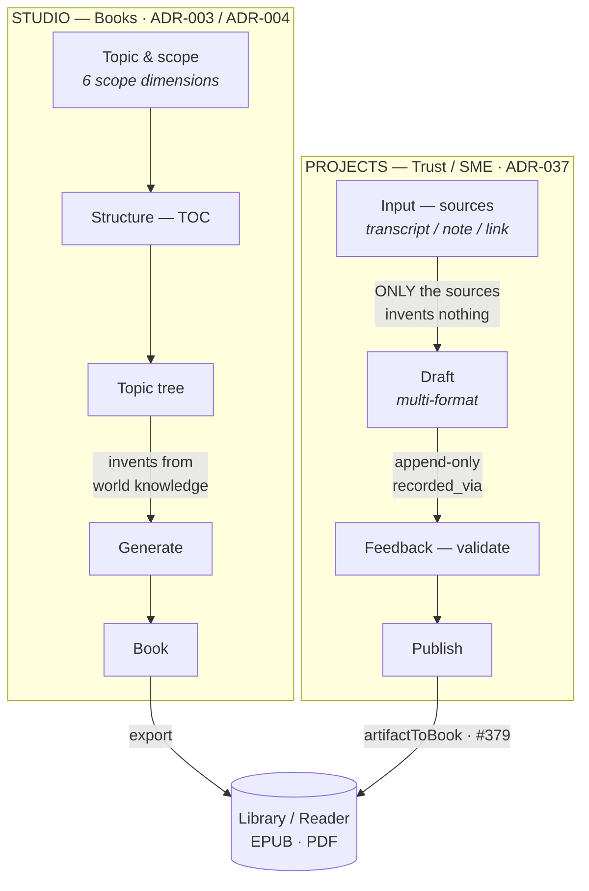
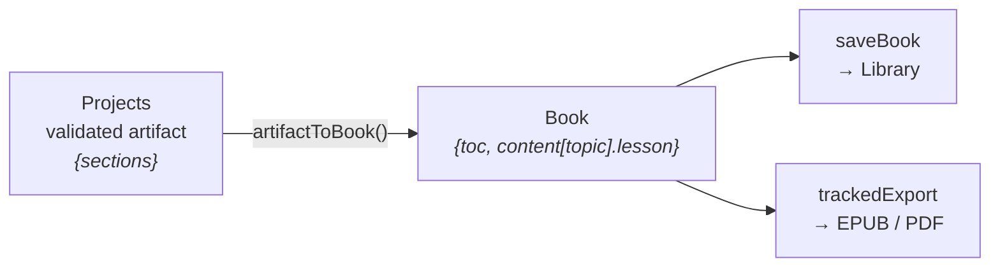

# Studio vs Projects — two authoring products, one app

Mentible ships two distinct authoring flows under one app. They look similar (both "make content
with AI") but are different products with different grounding and different trust models. They meet
only at the Library.

> **TL;DR**
> - **Studio** = *"generate me a book about X"* — LLM-authored from a topic, unvalidated, solo, local.
> - **Projects** = *"turn my expertise into trusted, source-grounded content a named expert signs off on"* — source-grounded, expert-validated, collaborative, backend.

---

## The two flows

Mermaid source (editable)

The single edge that separates the products is the one into **Generate** vs **Draft**: Studio
invents from the model's world knowledge (scoped by six dimensions); Projects drafts **only** from
the provided sources and invents nothing — then routes through an append-only expert approval. The
`artifactToBook` bridge (PR #379) is the only place the Trust flow reaches the Book world.

---

## Side-by-side

| Axis | **Studio** (Books) | **Projects** (Trust / SME) |
|---|---|---|
| **Purpose** | Author a book from a topic — the LLM writes it | Capture an expert's knowledge, draft from it, get it expert-validated |
| **Grounding** | Scoped retrieval over world knowledge (6 dimensions) | `invent nothing beyond the sources` |
| **Validation** | None — self-authored | Append-only expert approval · `recorded_via` |
| **Actors** | Solo author | Owner + invited reviewer (app-level access guard) |
| **Unit** | Multi-topic **Book** — TOC / topic tree | **Artifacts** with immutable **versions** |
| **Flow** | New Book → structure TOC → topic tree → generate → export | **Input → Drafts → Feedback → Publish** (Capture · Create · Validate · Share) |
| **Storage** | Local-first (`bookStore`, on device) | Backend trust tables (`project · artifact · version · approval`) |
| **Output** | EPUB / PDF + Library | Copy / Markdown, and (#379) **Add to Library + EPUB/PDF** |

---

## The core distinction

Both use the same LLM, but on opposite sides of a line:

- **Studio — grounding is the world.** You give a topic + scope (level, format, language, prior
  knowledge, framing); the model writes the content from what it knows. Fast, broad, unverified —
  it's the "Claude Code, but for learners" authoring surface.
- **Projects — grounding is *your sources*.** You paste an expert's raw material; the model drafts
  **only** from that ("invent nothing beyond the sources — if the sources don't cover something,
  omit it"), and nothing is "validated" until a **named expert approves** it (recorded with
  provenance: who, when, `recorded_via` = `expert_self` / `operator`). *"Trust is the product."*

Per **ADR-037**, Projects is the **new product spine** (SME-primary, "trust is the product"); Studio
is the **retained original** self-learner authoring mode (secondary).

---

## Where they converge

They cross only at the **Library**. A validated Projects artifact becomes a Studio-style **Book**
via `artifactToBook` (`mobile/src/lib/artifactToBook.ts`, PR #379), then exports EPUB / PDF through
the **same compiler** and lands on the same reader shelf. Upstream — sourcing, generation,
validation — the two stay deliberately separate products.

Borrowing Studio's *structuring UX* into Projects (the in-progress TOC arc) does **not** blur this:
Projects keeps its two differentiators — **grounding** (sources only) and **validation** (expert
approval) — while reusing Studio's outline editor.

---

## Where Projects is heading (in progress)

A design arc reframes Projects around a cornerstone book with an explicit **Structure (TOC)** phase —
`Input → Structure → Create (per topic) → Validate (per topic) → Publish` — so the author builds a
visible, source-derived outline before generating (fixes wayfinding + thin drafts). It borrows
Studio's `TopicTreeEditor` + `useStructureJob` but keeps Projects' grounding and validation. See
`docs/superpowers/specs/2026-08-07-projects-toc-structure-arc-design.md`.

---

## Code & ADR references

| | Studio | Projects |
|---|---|---|
| **Routes** | `app/(tabs)/books.tsx` · `app/book/*` | `app/(tabs)/projects.tsx` · `app/trust/*` |
| **Backend** | stateless authoring; local-first `Book` | `backend/src/trust/*` (migrations 0009–0013) |
| **ADRs** | ADR-003 (book authoring) · ADR-004 (two-product split + artifacts) | ADR-037 (SME expert-validation studio) |
| **Bridge** | — | `artifactToBook` · PR #379 (Publish → Add to Library + EPUB/PDF) |
