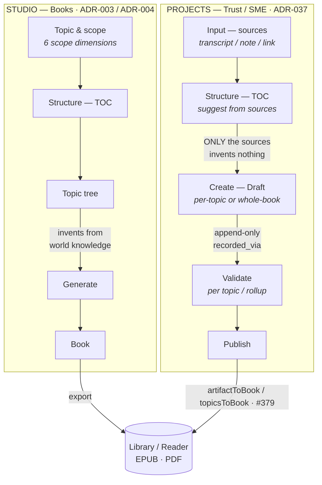
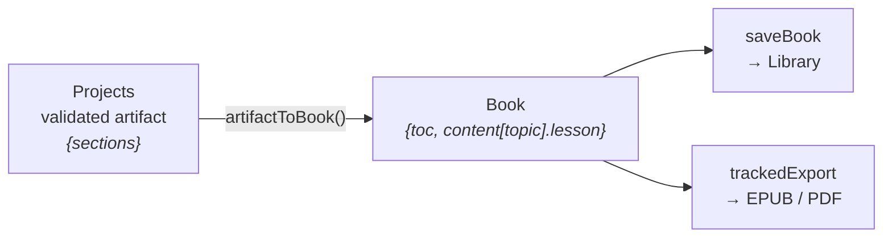

# Studio vs Projects — two authoring products, one app

Mentible ships two distinct authoring flows under one app. They look similar (both "make content
with AI") but are different products with different grounding and different trust models. They meet
only at the Library.

> **TL;DR**
> - **Studio** = *"generate me a book about X"* — LLM-authored from a topic, unvalidated, solo, local.
> - **Projects** = *"turn my expertise into trusted, source-grounded content a named expert signs off on"* — source-grounded, expert-validated, collaborative, backend.

---

## The two flows


<details>
<summary>Mermaid source (editable)</summary>



> The Mermaid source above is the current source of truth; the rendered `.svg` image may lag the
> latest flow.

</details>

The single edge that separates the products is the one into **Generate** vs **Draft**: Studio
invents from the model's world knowledge (scoped by six dimensions); Projects drafts **only** from
the provided sources and invents nothing — then routes through an append-only expert approval. The
`artifactToBook` bridge (PR #379) is the only place the Trust flow reaches the Book world.

---

## Side-by-side

| Axis | **Studio** (Books) | **Projects** (Trust / SME) |
|---|---|---|
| **Purpose** | Author a book from a topic — the LLM writes it | Capture an expert's knowledge, draft from it, get it expert-validated |
| **Grounding** | Scoped retrieval over world knowledge (6 dimensions) | `invent nothing beyond the sources` |
| **Validation** | None — self-authored | Append-only expert approval · `recorded_via` |
| **Actors** | Solo author | Owner + invited reviewer (app-level access guard) |
| **Unit** | Multi-topic **Book** — TOC / topic tree | **Artifacts** with immutable **versions**; drafts author **per-topic** (each topic its own `topic_version`) OR **whole-book** (one artifact, `artifact_version`s) — author picks per artifact |
| **Flow** | New Book → structure TOC → topic tree → generate → export | **Input → Structure (TOC) → Create → Validate → Publish** (Capture · Create · Validate · Share) — the TOC arc is **shipped + live** |
| **Storage** | Local-first (`bookStore`, on device) | Backend trust tables (`project · project_input · artifact · artifact_version · topic_version · approval · feedback`, migrations **0009–0015**) |
| **Diagrams** | Grounded ```mermaid / ```svg from world knowledge (compiler-themed) | Grounded ```mermaid / ```svg **from the sources** (whole-book/essay + per-topic); rendered **in-app** (reader) and in the **EPUB/PDF** (compiler) |
| **Output** | EPUB / PDF + Library | Copy / Markdown, and (#379) **Add to Library + EPUB/PDF** |

---

## The core distinction

Both use the same LLM, but on opposite sides of a line:

- **Studio — grounding is the world.** You give a topic + scope (level, format, language, prior
  knowledge, framing); the model writes the content from what it knows. Fast, broad, unverified —
  it's the "Claude Code, but for learners" authoring surface.
- **Projects — grounding is *your sources*.** You paste an expert's raw material; the model drafts
  **only** from that ("invent nothing beyond the sources — if the sources don't cover something,
  omit it"), and nothing is "validated" until a **named expert approves** it (recorded with
  provenance: who, when, `recorded_via` = `expert_self` / `operator`). *"Trust is the product."*

Per **ADR-037**, Projects is the **new product spine** (SME-primary, "trust is the product"); Studio
is the **retained original** self-learner authoring mode (secondary).

---

## Where they converge

They cross only at the **Library**. A validated Projects artifact becomes a Studio-style **Book**
via `artifactToBook` (`mobile/src/lib/artifactToBook.ts`, PR #379), then exports EPUB / PDF through
the **same compiler** and lands on the same reader shelf. Upstream — sourcing, generation,
validation — the two stay deliberately separate products.



Borrowing Studio's *structuring UX* into Projects (the shipped TOC arc) does **not** blur this:
Projects keeps its two differentiators — **grounding** (sources only) and **validation** (expert
approval) — while reusing Studio's outline editor.

---

## Projects today — the full loop (shipped + live)

The TOC arc is done: Projects is now `Input → Structure (TOC) → Create → Validate → Publish`, so the
author builds a visible, source-derived outline before generating (borrowed Studio's `TopicTreeEditor`
but kept Projects' grounding + validation). Two authoring modes coexist, picked per artifact:

- **Per-topic** — generate + validate each topic independently. Each topic carries its own
  `topic_version` (row-per-version) with a separate `topic_approval`; the project rolls up to
  `book_validated` when every current TOC topic is validated. The topic viewer renders the draft
  (diagrams and all) through the reader; owner/reviewer approve or withdraw per topic.
- **Whole-book** — one artifact drafted across sections in a single generation (multi-format:
  `book · essay · linkedin · x_thread · reel · podcast`; diagrams only for the long-form
  `book`/`essay`). The whole-book draft viewer renders its VIEW mode through the reader too (an
  opt-in inline/auto-height reader so it flows inside the page scroll); EDIT mode stays raw text.

**Regenerate vs new draft.** *Regenerating* an existing draft appends a new **version** (v2, v3…,
append-only, re-approval required); *starting a new draft* (the "Start a new draft" grid, or a fresh
"Suggest from Source") creates a **new artifact** at v1. Each version shows a **provenance line** —
*"Generated from N sources · with your guidance"* (from `generation_meta`) — so drafts are
distinguishable and the v1-vs-v2 model is legible.

See `docs/superpowers/specs/2026-08-07-projects-toc-structure-arc-design.md` and the per-topic /
whole-book / provenance specs under `docs/superpowers/specs/2026-08-*`.

---

## A note on the two meanings of "Studio"

"**Studio**" in this doc = the **Books authoring product** (topic → LLM-authored book). Separately,
"**Studio**" is also the name of the app-wide **visual identity** (the 2026-08 re-skin: a navy-dark /
refined-light theme, Playfair Display headings + Inter body, a single gold accent, ghost controls) —
applied across **both** products' surfaces, the reader (theme-reactive navy ↔ paper), and the
EPUB/PDF exports (light print artifact, navy/gold cover). The re-skin is a look, not a product; it
doesn't change the Studio-vs-Projects distinction below. See
`docs/superpowers/specs/2026-08-08-studio-reskin-design.md` (+ the P2–P4 slice specs).

---

## Code & ADR references

| | Studio | Projects |
|---|---|---|
| **Routes** | `app/(tabs)/books.tsx` · `app/book/*` | `app/(tabs)/projects.tsx` · `app/trust/*` |
| **Backend** | stateless authoring; local-first `Book` | `backend/src/trust/*` (migrations **0009–0015**; per-topic in `topic_repo`/`generate_topic`, whole-book in `artifact_repo`/`generate`, shared diagram guidance in `diagram_guidance.py`) |
| **ADRs** | ADR-003 (book authoring) · ADR-004 (two-product split + artifacts) | ADR-037 (SME expert-validation studio) |
| **Bridge** | — | `artifactToBook` (single) / `topicsToBook` (per-topic) · PR #379 (Publish → Add to Library + EPUB/PDF) |
